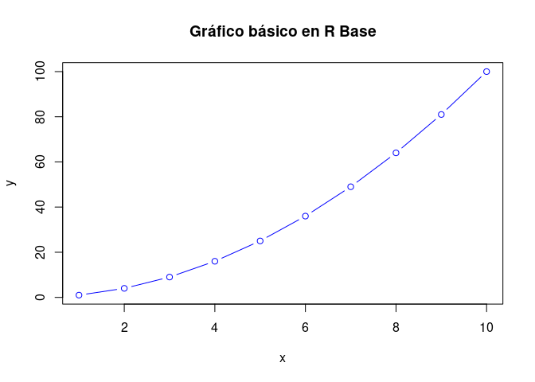
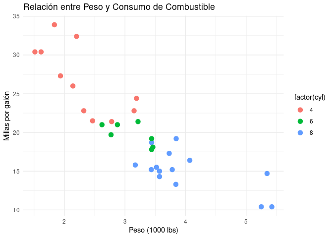

Graficos_interactivos
================
Carmen Lancho Martín - DSLAB

## Introducción

En esta charla vamos a explorar cómo crear gráficos en R, comenzando por
gráficos básicos en R base, luego avanzaremos hacia gráficos más
complejos con `ggplot2`, y finalmente incorporaremos interactividad con
`plotly`. Al final, generaremos un archivo HTML con todos los gráficos
para compartir de forma fácily visual los resultados.

## Gráficos en R Base

Primero, vamos a empezar con la creación de gráficos básicos usando las
funciones incorporadas en R. Usaremos un conjunto de datos sencillo para
ilustrar esto.

**Ejemplo de gráfico básico:**

``` r
# Generar datos
x <- 1:10
y <- x^2

# Crear gráfico básico en R Base
plot(x, y, type = "b", col = "blue", main = "Gráfico básico en R Base")
```



Explicación:

-   `plot()` es la función básica de R para crear gráficos.
-   `type = "b"` indica que queremos líneas y puntos.
-   `col = "blue"` cambia el color de la línea a azul.
-   `main` añade un título al gráfico.

## Gráficos con ggplot2

`ggplot2` es una de las bibliotecas más utilizadas para la creación de
gráficos complejos y personalizables. Su sistema de “gramática de
gráficos” facilita la creación de gráficos detallados y estilizados.
Vamos a usar el conjunto de datos mtcars.

**Ejemplo de gráfico con `ggplot2`:**

``` r
# Cargar librería
library(ggplot2)

# Crear gráfico con ggplot2
ggplot(mtcars, aes(x = wt, y = mpg, color = factor(cyl))) +
  geom_point(size = 3) +
  labs(title = "Relación entre Peso y Consumo de Combustible",
       x = "Peso (1000 lbs)", y = "Millas por galón") +
  theme_minimal()
```



Explicación:

-   `ggplot()` inicializa el gráfico y `aes()` define los ejes y las
    variables.
-   `geom_point()` añade puntos al gráfico y define el tamaño de los
    puntos.
-   `labs()` permite añadir títulos y etiquetas a los ejes.
-   `theme_minimal()` aplica un estilo simple al gráfico.

## Gráficos interactivos con plotly

`plotly` permite agregar interactividad a los gráficos, lo que resulta
útil para presentaciones y exploración de datos. Convertir gráficos de
`ggplot2` a `plotly` es fácil.

``` r
# Cargar librería
library(plotly)
```


    Attaching package: 'plotly'

    The following object is masked from 'package:ggplot2':

        last_plot

    The following object is masked from 'package:stats':

        filter

    The following object is masked from 'package:graphics':

        layout

``` r
# Crear gráfico interactivo
p <- ggplot(mtcars, aes(x = wt, y = mpg, color = factor(cyl))) +
  geom_point(size = 3) +
  labs(title = "Gráfico interactivo: Relación entre Peso y Consumo de Combustible",
       x = "Peso (1000 lbs)", y = "Millas por galón") +
  theme_minimal()

# Convertir a gráfico interactivo con plotly
ggplotly(p)
```

<div id="htmlwidget-646082541a070f082a90" style="width:672px;height:480px;" class="plotly html-widget"></div>
<script type="application/json" data-for="htmlwidget-646082541a070f082a90">{"x":{"data":[{"x":[2.3199999999999998,3.1899999999999999,3.1499999999999999,2.2000000000000002,1.615,1.835,2.4649999999999999,1.9350000000000001,2.1400000000000001,1.5129999999999999,2.7799999999999998],"y":[22.800000000000001,24.399999999999999,22.800000000000001,32.399999999999999,30.399999999999999,33.899999999999999,21.5,27.300000000000001,26,30.399999999999999,21.399999999999999],"text":["wt: 2.320<br />mpg: 22.8<br />factor(cyl): 4","wt: 3.190<br />mpg: 24.4<br />factor(cyl): 4","wt: 3.150<br />mpg: 22.8<br />factor(cyl): 4","wt: 2.200<br />mpg: 32.4<br />factor(cyl): 4","wt: 1.615<br />mpg: 30.4<br />factor(cyl): 4","wt: 1.835<br />mpg: 33.9<br />factor(cyl): 4","wt: 2.465<br />mpg: 21.5<br />factor(cyl): 4","wt: 1.935<br />mpg: 27.3<br />factor(cyl): 4","wt: 2.140<br />mpg: 26.0<br />factor(cyl): 4","wt: 1.513<br />mpg: 30.4<br />factor(cyl): 4","wt: 2.780<br />mpg: 21.4<br />factor(cyl): 4"],"type":"scatter","mode":"markers","marker":{"autocolorscale":false,"color":"rgba(248,118,109,1)","opacity":1,"size":11.338582677165356,"symbol":"circle","line":{"width":1.8897637795275593,"color":"rgba(248,118,109,1)"}},"hoveron":"points","name":"4","legendgroup":"4","showlegend":true,"xaxis":"x","yaxis":"y","hoverinfo":"text","frame":null},{"x":[2.6200000000000001,2.875,3.2149999999999999,3.46,3.4399999999999999,3.4399999999999999,2.77],"y":[21,21,21.399999999999999,18.100000000000001,19.199999999999999,17.800000000000001,19.699999999999999],"text":["wt: 2.620<br />mpg: 21.0<br />factor(cyl): 6","wt: 2.875<br />mpg: 21.0<br />factor(cyl): 6","wt: 3.215<br />mpg: 21.4<br />factor(cyl): 6","wt: 3.460<br />mpg: 18.1<br />factor(cyl): 6","wt: 3.440<br />mpg: 19.2<br />factor(cyl): 6","wt: 3.440<br />mpg: 17.8<br />factor(cyl): 6","wt: 2.770<br />mpg: 19.7<br />factor(cyl): 6"],"type":"scatter","mode":"markers","marker":{"autocolorscale":false,"color":"rgba(0,186,56,1)","opacity":1,"size":11.338582677165356,"symbol":"circle","line":{"width":1.8897637795275593,"color":"rgba(0,186,56,1)"}},"hoveron":"points","name":"6","legendgroup":"6","showlegend":true,"xaxis":"x","yaxis":"y","hoverinfo":"text","frame":null},{"x":[3.4399999999999999,3.5699999999999998,4.0700000000000003,3.73,3.7799999999999998,5.25,5.4240000000000004,5.3449999999999998,3.52,3.4350000000000001,3.8399999999999999,3.8450000000000002,3.1699999999999999,3.5699999999999998],"y":[18.699999999999999,14.300000000000001,16.399999999999999,17.300000000000001,15.199999999999999,10.4,10.4,14.699999999999999,15.5,15.199999999999999,13.300000000000001,19.199999999999999,15.800000000000001,15],"text":["wt: 3.440<br />mpg: 18.7<br />factor(cyl): 8","wt: 3.570<br />mpg: 14.3<br />factor(cyl): 8","wt: 4.070<br />mpg: 16.4<br />factor(cyl): 8","wt: 3.730<br />mpg: 17.3<br />factor(cyl): 8","wt: 3.780<br />mpg: 15.2<br />factor(cyl): 8","wt: 5.250<br />mpg: 10.4<br />factor(cyl): 8","wt: 5.424<br />mpg: 10.4<br />factor(cyl): 8","wt: 5.345<br />mpg: 14.7<br />factor(cyl): 8","wt: 3.520<br />mpg: 15.5<br />factor(cyl): 8","wt: 3.435<br />mpg: 15.2<br />factor(cyl): 8","wt: 3.840<br />mpg: 13.3<br />factor(cyl): 8","wt: 3.845<br />mpg: 19.2<br />factor(cyl): 8","wt: 3.170<br />mpg: 15.8<br />factor(cyl): 8","wt: 3.570<br />mpg: 15.0<br />factor(cyl): 8"],"type":"scatter","mode":"markers","marker":{"autocolorscale":false,"color":"rgba(97,156,255,1)","opacity":1,"size":11.338582677165356,"symbol":"circle","line":{"width":1.8897637795275593,"color":"rgba(97,156,255,1)"}},"hoveron":"points","name":"8","legendgroup":"8","showlegend":true,"xaxis":"x","yaxis":"y","hoverinfo":"text","frame":null}],"layout":{"margin":{"t":43.762557077625573,"r":7.3059360730593621,"b":40.182648401826491,"l":37.260273972602747},"font":{"color":"rgba(0,0,0,1)","family":"","size":14.611872146118724},"title":{"text":"Gráfico interactivo: Relación entre Peso y Consumo de Combustible","font":{"color":"rgba(0,0,0,1)","family":"","size":17.534246575342465},"x":0,"xref":"paper"},"xaxis":{"domain":[0,1],"automargin":true,"type":"linear","autorange":false,"range":[1.3174499999999998,5.6195500000000003],"tickmode":"array","ticktext":["2","3","4","5"],"tickvals":[2,3,4,5],"categoryorder":"array","categoryarray":["2","3","4","5"],"nticks":null,"ticks":"","tickcolor":null,"ticklen":3.6529680365296811,"tickwidth":0,"showticklabels":true,"tickfont":{"color":"rgba(77,77,77,1)","family":"","size":11.68949771689498},"tickangle":-0,"showline":false,"linecolor":null,"linewidth":0,"showgrid":true,"gridcolor":"rgba(235,235,235,1)","gridwidth":0.66417600664176002,"zeroline":false,"anchor":"y","title":{"text":"Peso (1000 lbs)","font":{"color":"rgba(0,0,0,1)","family":"","size":14.611872146118724}},"hoverformat":".2f"},"yaxis":{"domain":[0,1],"automargin":true,"type":"linear","autorange":false,"range":[9.2249999999999996,35.074999999999996],"tickmode":"array","ticktext":["10","15","20","25","30","35"],"tickvals":[10,15,20,25,30,35],"categoryorder":"array","categoryarray":["10","15","20","25","30","35"],"nticks":null,"ticks":"","tickcolor":null,"ticklen":3.6529680365296811,"tickwidth":0,"showticklabels":true,"tickfont":{"color":"rgba(77,77,77,1)","family":"","size":11.68949771689498},"tickangle":-0,"showline":false,"linecolor":null,"linewidth":0,"showgrid":true,"gridcolor":"rgba(235,235,235,1)","gridwidth":0.66417600664176002,"zeroline":false,"anchor":"x","title":{"text":"Millas por galón","font":{"color":"rgba(0,0,0,1)","family":"","size":14.611872146118724}},"hoverformat":".2f"},"shapes":[{"type":"rect","fillcolor":null,"line":{"color":null,"width":0,"linetype":[]},"yref":"paper","xref":"paper","x0":0,"x1":1,"y0":0,"y1":1}],"showlegend":true,"legend":{"bgcolor":null,"bordercolor":null,"borderwidth":0,"font":{"color":"rgba(0,0,0,1)","family":"","size":11.68949771689498},"title":{"text":"factor(cyl)","font":{"color":"rgba(0,0,0,1)","family":"","size":14.611872146118724}}},"hovermode":"closest","barmode":"relative"},"config":{"doubleClick":"reset","modeBarButtonsToAdd":["hoverclosest","hovercompare"],"showSendToCloud":false},"source":"A","attrs":{"49e461f0d573":{"x":{},"y":{},"colour":{},"type":"scatter"}},"cur_data":"49e461f0d573","visdat":{"49e461f0d573":["function (y) ","x"]},"highlight":{"on":"plotly_click","persistent":false,"dynamic":false,"selectize":false,"opacityDim":0.20000000000000001,"selected":{"opacity":1},"debounce":0},"shinyEvents":["plotly_hover","plotly_click","plotly_selected","plotly_relayout","plotly_brushed","plotly_brushing","plotly_clickannotation","plotly_doubleclick","plotly_deselect","plotly_afterplot","plotly_sunburstclick"],"base_url":"https://plot.ly"},"evals":[],"jsHooks":[]}</script>

Explicación:

-   `ggplotly(p)` convierte un gráfico estático de ggplot2 en un gráfico
    interactivo.

## Generar archivo HTML

Finalmente, puedes generar un archivo HTML con el siguiente comando en R
para compartir los resultados:

<!-- quarto_render("archivo_quarto.qmd") -->
